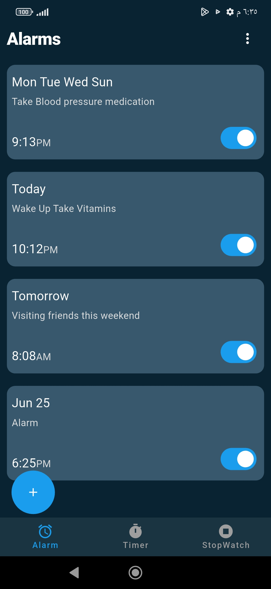

#  Flutter Alarm App
A cross-platform alarm clock app built with Flutter. Supports reliable scheduling, repeat alarms, and local persistence using Drift.

## Features

- One-time and repeating alarms
- Weekday-based repeat support
- Timezone-aware scheduling
- Custom alarm sounds
- Local database storage (Drift)
- State management with Riverpod
- Works on Android and iOS

## Tech Stack

| Category | Packages |
|----------|----------|
| **Framework** | Flutter, Dart |
| **State Management** | flutter_riverpod |
| **Database** | drift, shared_preferences |
| **Alarm & Scheduling** | alarm, timezone, flutter_timezone |
| **Audio** | just_audio, audio_session |

## Architecture

```
UI -> Providers  -> Services -> Repository -> Database
```


## Platform Behavior

### Android

Alarms use native Android scheduling with full background support. Exact timing is reliable.

### iOS

Due to iOS system restrictions, the `alarm` package uses local notification scheduling instead of a true background service:

- **App in foreground or background**: Alarm triggers inside the app normally
- **App closed or killed**: Falls back to a local notification
- **Limitations**: Background execution is restricted, so exact timing isn't guaranteed
- **Sound**: Limited to ~30 seconds (notification payload limit)

## Screenshots


## Getting Started

```bash
git clone https://github.com/WagdiSaif/flutter_alarm_app.git
cd flutter_alarm_app
flutter pub get
```

Generate database files:

```bash
dart run build_runner build --delete-conflicting-outputs
```

Run the app:

```bash
flutter run
```

## Supported Platforms

- Android
- iOS


## Notes

- Alarm accuracy depends on device battery optimization settings
- iOS behavior is limited by system restrictions
- Timezone handling is required for correct scheduling across regions


## License

MIT

## Author

Wagdi Saif
```