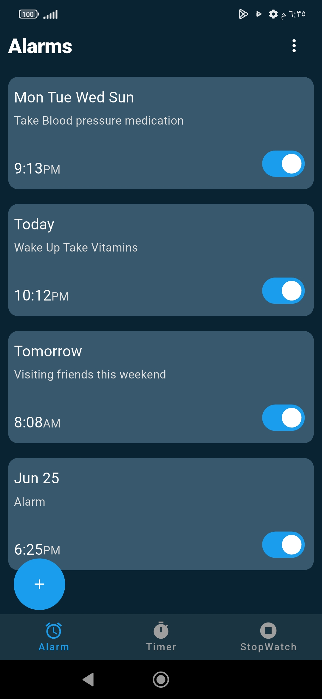
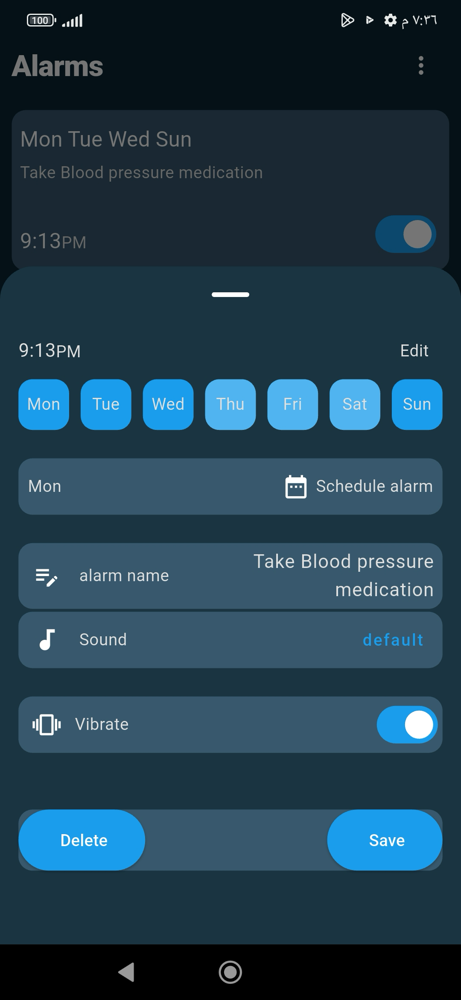

#  Flutter Alarm App
 Cross-platform alarm clock, stopwatch, and timer application built with Flutter. It uses native background services on Android and Apple's Live Activities on iOS to keep timers running accurately across app states, with graceful fallbacks when platform restrictions apply.

## Features

- One-time and weekday-based repeating alarms
- Timezone-aware scheduling to prevent drift across regions
- High-precision Stopwatch with lap tracking (millisecond accurate)
- Countdown Timer with support for ongoing lock-screen updates
- Background persistence so counters continue if the app is closed or force-killed
- Interactive iOS Live Activities and Dynamic Island support


## Tech Stack

| Category | Packages |
|----------|----------|
| **Framework** | Flutter, Dart |
| **State Management** | `flutter_riverpod`, `rxdart` |
| **Database** | `drift`, `drift_flutter`, `shared_preferences` |
| **Alarm & Scheduling** | `alarm`, `timezone`, `flutter_timezone` |
| **Audio** | `just_audio`, `audio_session` |
| **Background Orchestration** | `flutter_foreground_task`, `flutter_local_notifications` |
| **iOS Core Extensions** | `live_activities` (Apple ActivityKit Bridge) |
| **Permissions** | `permission_handler`, `battery_optimization_helper` |
| **Utilities & UI Helpers** | `file_picker`, `intl`, `path`, `json_annotation`, `fluttertoast`, `flutter_native_splash` |

## Architecture

```
UI -> Providers   -> Repository -> Database
```


## Platform Behavior

### Android

Alarms use native Android scheduling with full background support. Exact timing is reliable.

Foreground Service: When the stopwatch or countdown timer is running and the user exits or kills the app, flutter_foreground_task triggers an active background process to keep the counts running stably.

Concurrent Execution: If both the timer and stopwatch run simultaneously, flutter_local_notifications serves as a helper layout to display both trackers side-by-side.

Battery Optimization: Includes power-management helpers to handle aggressive background restriction layouts on specific OEM devices.

### iOS

Due to iOS system restrictions, the `alarm` package uses local notification scheduling instead of a true background service:

- **App in foreground or background**: Alarm triggers inside the app normally
- **App closed or killed**: Falls back to a local notification
- **Limitations**: Background execution is restricted, so exact timing isn't guaranteed
- **Sound**: Limited to ~30 seconds (notification payload limit)

## Screenshots
<table>
<tr> <td> </td>

<td> </td></tr>
</table>


## Getting Started

```bash
git clone https://github.com/WagdiSaif/flutter_alarm_app.git
cd flutter_alarm_app
flutter pub get
```

Generate database files:

```bash
dart run build_runner build --delete-conflicting-outputs
```

Run the app:

```bash
flutter run
```

## Supported Platforms

- Android
- iOS


## Notes

- Alarm accuracy depends on device battery optimization settings
- iOS behavior is limited by system restrictions
- Timezone handling is required for correct scheduling across regions
## Contact

For questions or suggestions, reach out at:

- Email: [Wagdi](mailto:wagdisaif121@gmail.com)
- GitHub: [@Wagdi](https://github.com/WagdiSaif)


## License

MIT

## Author

Wagdi Saif
```